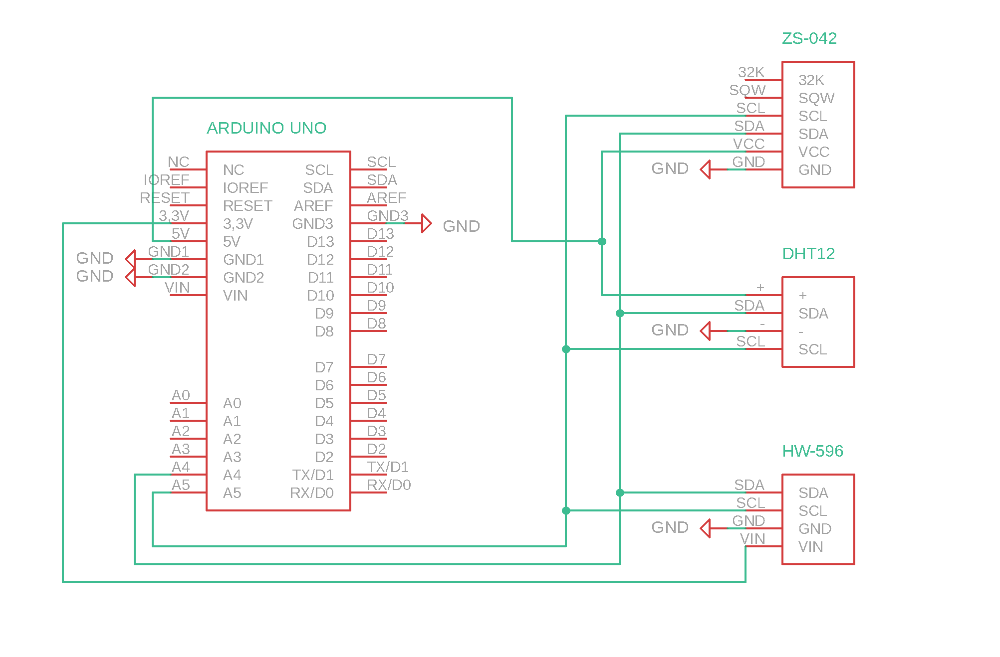

# AVR Portable Environmental Logger

## Popis projektu

Tento projekt je **prenosný environmentálny data logger** napísaný v čistom **AVR C** (bez použitia Arduino Frameworku). Systém meria a ukladá údaje priamo do internej **EEPROM** pamäte mikrokontroléra ATmega328P.

Program funguje ako **interaktívny terminál**, ktorý cez sériový port (UART) ponúka menu s tromi režimami:

1.  **Logger:** Zápis dát (Teplota, Vlhkosť, Tlak, Čas) každých 5 sekúnd.
2.  **Reader:** Čítanie a výpis uložených dát v prehľadnej tabuľke.
3.  **Eraser:** Vymazanie pamäte EEPROM.

**Projekt nevyžaduje SD kartu** – všetko sa ukladá priamo do internej pamäte MCU.

---

## Hardvér a Zapojenie

### Komponenty
* **MCU:** Arduino Uno (ATmega328P, 16 MHz)
* **RTC:** ZS-042 (čip DS3231) – Reálny čas
* **Senzor T/H:** DHT12 – Teplota a Vlhkosť
* **Senzor Tlaku:** BMP180 – Atmosférický tlak

### Schéma zapojenia (I²C zbernica)

Všetky senzory sú pripojené paralelne na I²C zbernicu. Senzor BMP180 vyžaduje napájanie 3.3V.



| Senzor | Pin na module | Arduino Uno Pin | AVR Pin |
| :--- | :--- | :--- | :--- |
| **DHT12** | SDA | A4 | PC4 |
| | SCL | A5 | PC5 |
| | VCC | 5V | - |
| | GND | GND | - |
| **ZS-042** | SDA | A4 | PC4 |
| **(DS3231)**| SCL | A5 | PC5 |
| | VCC | 5V | - |
| | GND | GND | - |
| **BMP180** | SDA | A4 | PC4 |
| | SCL | A5 | PC5 |
| | VCC | 3.3V | - |
| | GND | GND | - |

---

## Softvér

Projekt je napísaný v **C (AVR-GCC)** a využíva nízkoúrovňové knižnice pre maximálnu efektivitu.

### Zoznam súborov
| Súbor | Účel |
| :--- | :--- |
| `main.c` | Hlavný program (Menu, Logika loggera, Výpočty BMP180, EEPROM) |
| `twi.h` / `twi.c` | Knižnica pre I²C/TWI komunikáciu (Avr Labs Tomas Fryza) |
| `uart.h` / `uart.c` | Knižnica pre UART komunikáciu (Peter Fleury) |
| `timer.h` | Makrá pre konfiguráciu Timer1 (Avr Labs Tomas Fryza) |

---

## Návod na použitie

1.  Nahrajte kód do mikrokontroléra.
2.  Otvorte **Serial Monitor** (Putty, RealTerm, VS Code).
3.  Nastavte rýchlosť na **115200 Bd**.
4.  Po reštarte (tlačidlo RESET) sa zobrazí interaktívne menu:

```text
=== DATA LOGGER MENU ===
 1) START LOGGER (T/H + RTC + Tlak)
 2) START READER
 3) START ERASER
Volba:
```
### Režimy:

#### 1. LOGGER (Zápis)
* Stlačte klávesu `1`.
* Systém začne každých **5 sekúnd** ukladať dáta.
* Ak je pamäť plná, nahrávanie sa zastaví a vypíše `[WARNING] Full Memory`.
* **Indikácia cez UART (real-time):**
    ```text
    LOG: 12:00:05 | T:24 C | H:45 % | P:1013 hPa
    ```
* *Pre ukončenie a návrat do menu stlačte tlačidlo RESET na doske.*

#### 2. READER (Čítanie)
* Stlačte klávesu `2`.
* Vypíše všetky uložené dáta formátované do stĺpcov.
* **Výstup:**
    ```text
    --- VYPIS DAT ---
    Pocet: 15
    ID  | CAS         | T[C] | H[%] | P[hPa]
    000 | 12:15:05    |   23 |   45 | 1013
    001 | 12:15:10    |   23 |   46 | 1013
    ...
    --- KONIEC ---
    ```

#### 3. ERASER (Mazanie)
* Stlačte klávesu `3`.
* Celá pamäť EEPROM sa prepíše hodnotou `0xFF` a index záznamov sa vynuluje.
* *Odporúča sa spustiť pred každým novým meracím cyklom.*

### Ukážka fungovania

Kliknite na obrázok nižšie pre spustenie videa na YouTube:

[](https://youtu.be/ielnsvkVewc)
---
## Technické parametre

* **Úložisko:** Interná EEPROM (1024 Bajtov)
* **Interval merania:** 5 sekúnd (Možné jednoducho zmeniť v `#define LOG_INTERVAL`)
* **Veľkosť jedného záznamu:** 7 Bajtov
    * `Hodina` (1B), `Minúta` (1B), `Sekunda` (1B)
    * `Teplota` (1B, signed int)
    * `Vlhkosť` (1B, unsigned int)
    * `Tlak` (2B, unsigned int, hPa)

### Kapacita pamäte
Vzhľadom na veľkosť internej EEPROM a štruktúru dát:

$$\text{Kapacita} = \frac{1024 \text{ B}}{7 \text{ B}} \approx \mathbf{146} \text{ záznamov}$$

* **Celkový čas záznamu:**
    * *Pri testovacom intervale 5 s:*
      $146 \times 5 \text{ s} \approx 730 \text{ s} \approx \mathbf{12 \text{ min}}$
    * *Pri reálnom intervale ako napríklad 5 minút:*
      $146 \times 300 \text{ s} = 43800 \text{ s} \approx \mathbf{12 \text{ hod } 10 \text{ min}}$

---

## Autori

* **Autori:** Lukáš Hrobák, Richard Tomanička, Jan Trojak
* **Inštitúcia:** VUT Brno, FEKT

---

## Zdroje a Použitá literatúra

### Datasheets
* **BMP180:** [Bosch Sensortec BST-BMP180-DS000](https://cdn-shop.adafruit.com/datasheets/BST-BMP180-DS000-09.pdf)  
* **DHT12:** [DHT12 Manual](https://robototehnika.ru/file/DHT12.pdf)
* **DS3231:** [DS32131 Manual](https://www.analog.com/media/en/technical-documentation/data-sheets/ds3231.pdf)

### Externé knižnice a nástroje
* **UART Library:** [Peter Fleury AVR Software](http://jump.to/fleury)
* **Avr Labs Tomas Fryza:**  [AVR course at Brno University of Technology](https://github.com/tomas-fryza/avr-labs/)


*(Projekt vznikol v rámci predmetu Digitálna elektronika 2)*
